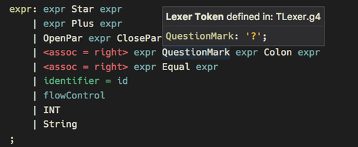
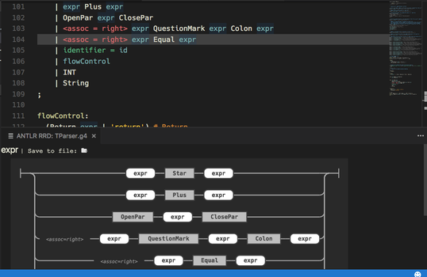
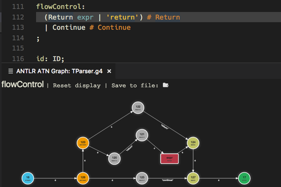

# vscode-antlr4

This extension for Visual Studio code adds support for ANTLR4 grammars.

## Features

This extension adds support for ANTLR4 grammar files, which includes these features:

* Syntax coloring for ANTLR grammars (.g and .g4 files).

* An own color theme, which not only includes all the [recommended groups](http://manual.macromates.com/en/language_grammars), but also some special rules for grammar elements that you don't find in other themes.
* **Parser generation** on save.
* Syntax and some semantic error checking (symbol matching) done internally, for quick feedback on edit and/or if no parser generation is available.
* 
* **Code completion**.
* Quick navigation via ctrl/cmd+click.
* The symbol list for quick navigation (via shift+ctrl/cmd+O).
* Hovers (tooltips) with symbol information.
* Rule reference counts via code lens.
* **Railroad diagrams** for all types of rules (parser, lexer, fragment lexer).

* ATN graphs for all rule types. This is a visualization of the internal ATN that drives lexers + parsers. It uses D3.js for layout and interaction. Nodes can be repositioned with the mouse and you can drag and zoom the image. The transformation and position state is restored when reopening a graph.
* 

## Extension Settings

* **antlr4.referencesCodeLens.enabled**, boolean (default: false), if true enables code lens feature
* **antlr4.rrd.customcss**, array of string (default: empty array), list of custom css URIs for railroad diagrams
* **antlr4.rrd.saveDir**, string (default: empty/undefined), default export target folder for railroad diagrams
* **antlr4.atn.customcss**, array of string (default: empty array), list of custom css URIs for ATN graphs
* **antlr4.atn.saveDir**, string (default: empty/undefined), default export target folder for railroad diagrams
* **antlr4.atn.maxLabelCount**, number (default: 3), max number of labels displayed on a transition in an ATN graph
* **antlr4.generation.mode**, string enum (default: "internal"), determines what code generation pattern should be followed:
    * **none**: Don't generate any code, not even for internal use.
    * **internal**: Allow code generation for internal use (e.g. for full error detection and interpreter data).
    * **external**: Generate code also for external use, depending on the other generation options.
* **antlr4.generation.outputDir**, string (default: empty/undefined), determines the output folder where to place generated code (used only if **antlr4.generation.mode** is set to "external")
* **antlr4.generation.importDir**, string (default: empty/undefined), location to import grammars from (relative to the grammar that is being saved, or absolute path), used also for internal code generation
* **antlr4.generation.package**, string (default: empty/undefined), package/namespace for generated code (used only in external mode)
* **antlr4.generation.language**, string (default: "Java"), specifies the target language for the generated code, overriding what is specified in the grammar (used only in external mode)
* **antlr4.generation.listeners**, boolean (default: true), also create listeners on code generation (used only in external mode)
* **antlr4.generation.visitors**, boolean (default: false), also create visitors on code generation (used only in external mode)

## Known Issues

None

## What's next?

* Show reference list for a symobl
* Code formatter
* Refactoring (rename symbols, remove left recursion etc.)
* Live grammar interpreter for grammar preview
    * Specify test input (file or a string) + a start rule
    * Token list
    * Parse tree display
    * Call stack

## Release Notes

For details see [Git commit history](https://github.com/mike-lischke/vscode-antlr4/commits/master).
