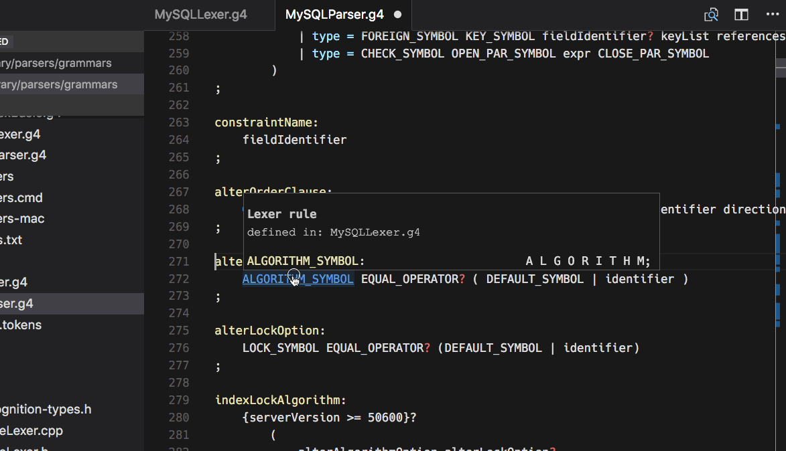

# vscode-antlr4

This extension for Visual Studio code adds support for ANTLR4 grammars.

## Features

This extension adds support for ANTLR4 grammar files, which includes these features:

* Syntax coloring for ANTLR grammars (.g and .g4 files).
* An own color theme, which not only includes all the [recommended groups](http://manual.macromates.com/en/language_grammars), but also some special rules for grammar elements that you don't find in other themes.
* Syntax and some semantic error checking (symbol matchin)
* Quick navigation via ctrl/cmd+click.
* The symbol list for quick navigation (via shift+ctrl/cmd+O).
* Hovers (tooltips) with symbol information.

## Extension Settings

Nothing for now.

## Known Issues

* The native module used for parsing (antlr4-graps) seems to have trouble with Visual Studio Code on Windows. It works nicely in a standalone node session there, though.
* The prebuilt Linux binary also seems to have some trouble on certain installations/distros. Need to investigate that yet.
* The complete-light color theme is not fully done yet.

## Release Notes

### 0.0.1

Initial vscode-antlr4 project.

### 0.2.0

* full setup of the project
* added most of the required settings etc.
* included dark theme is complete

### 0.3.0

Additions and updates for publishing the extension.

### 0.3.4

Marked the extension as preview and added prebuild binaries.

### 0.3.7

Added a demo animation.

### 0.4.0

- Updated the symbol handling for the latest change in the antlr4-graps module. We now also show different icons depending on the type of the symbol.
- Updated prebuilt antlr4-graps binaries for all platforms.
- Quick navigation has been extended to imports/tokenvocabs and lexer modes.
- The symbols list now contains some markup to show where a section with a specific lexer mode starts.
- Fixed also a little mishighlighting in the language syntax file.
- Added a license file.

### 0.4.1

- Bug fix (node module reference).
- Corrected version number

