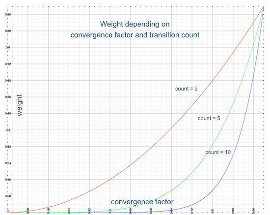

# Sentence Generation

## General

For testing, validation or other tasks it is often useful to create random sentences from a grammar definition. It's sometimes pretty entertaining what input your grammar would accept. Usually rules are accepting more than what you would normally allow as syntax. For example MySQL identifiers can be constructed from all code points in the Unicode Basic Multilingual Plane (BMP). However this block contains many entries which are simply not useful for identifiers (control codes, unassigned code points, combining marks and more). However, sentence generation will by default create identifiers from all of those code points. More about that below.

**Sentence generation is not configured in the extension settings, but uses a side-car json file, to allow per-grammar generation.**

## Usage

Open an ANTLR4 grammar in VS Code and wait until internal parser generation is done (which takes usually just a second or two). Once the interpreter data was generated (which is also required for debugging) you can right click in a rule and select the `Generate Valid Input for Rule` menu entry. This will start the process and prints the generated strings for the selected rule to the `ANTLR4 Sentence Generation` output channel. It uses default settings, unless a configuration file is found.

A generated sentence is a single line with no formatting (as whitespaces are usually put on a hidden channel), and a single space character between every token. Such a string must be parsable with the grammar it was created from, but not necessarily using the same rules that have been used to create it, because often multiple rules can match the same (partial) input.

## Configuring Generation

To configure sentence generation for a grammar, create a file with the name of the grammar, but with the `json` extension, and place it directly beside the grammar. The file must contain a top level object, with the following fields (which are all optional):

```json
{
    "count": 1,
    "clear": true,
    "convergenceFactor": 0.25,
    "minParserIterations": 1,
    "maxParserIterations": 2,
    "minLexerIterations": 0,
    "maxLexerIterations": 10,
    "maxRecursions": 3,
    "ruleMappings": {
    },
    "actionFile": ""
}
```

- **count** (number, default: 1): The number of sentences to generate in one call.
- **clear** (boolean, default: true): Clear output window on each run (used for output printing in the UI).
- **convergenceFactor** (number, default: 0.25: Determines how quick the weight for a decision converges towards 0 (between 0 and 1).
- **minParserIterations** (number, default: 0): The minimum number of iterations used for `+` and `*` loops in the parser (default: 1 for `+`, 0 for `*`). Must be a positive integer (or 0) and must be smaller than `maxParserIterations` (if that is given). If set to 0 then for `+` loops 1 is used, automatically.
- **maxParserIterations** (number, default: minParserIterations + 1): The maximum number of iterations in the parser. Must be a number > 0 and > `minParserIterations`. If that is not the case or the value is not specified then it is set to `minParserIterations` + 1.
- **minLexerIterations** (number, default: 0): The minimum number of iterations in the lexer (default: 1 for `+`, 0 for `*`). Must be a positive integer (or 0) and must be smaller than `maxLexerIterations` (if that is given). If set to 0 then for `+` loops 1 is used, automatically.
- **maxLexerIterations** (number, default: minLexerIterations + 10): The maximum number of iterations in the lexer. Must be a number > 0 and > than `minLexerIterations`. If that is not the case or the value is not specified then it is set to `minLexerIterations` + 10.
- **maxRecursions** (number, default: 3): The maximum number of recursions (rules calling themselves directly or indirectly).
- **ruleMappings** (object, default: none): A mapping of rule names to string literals or array of strings, which should be used instead of running the generation for that rule. For more details see below.
- **actionFile** (string, default: none): The name of a file which contains code to evaluate grammar actions and predicates.

### Loops

Rule definitions in grammars often use loops:

- recursive invocations
- BNF operators: `?`, `*` and `+`

To avoid endless processing, maximum loop counts are used. These numbers can have smaller impact (e.g. the length of generated identifiers) or make generated output enormously more complex (when repeating large rules and their subrules). Therefore you should start experimenting with small values for `maxParserIterations`. There are also minimum counterparts for iterations, to specify how often iterations at least should be run through.

Recursions are relevant mostly for parser rules. They can be direct (a rule calls itself) or indirect (a rule calls another rule, which then calls the original rule again). Each invocation of a rule during a parse run is recorded in the so-called invocation stack. With this structure it is possible to determine how often a specific rules has already been invoked. The same can be applied to the generation process, which is a walk over the ATN. Potentially, recursions also can lead to endless processing, which is why there is `maxRecursions`, which determines how often a rule appears in the invocation stack (at any level).

### Rule Mappings

The rule mappings object provides a way to explicitly specify the value for lexer or parser rules, instead of having the generator create one for them. This is often used to make sentences more readable. For example you can define a fixed value for your string rules. Let's assume there's a rule `SingleQuotedString` in your lexer, which matches all strings that are delimited by single quotes. You could define a mapping like:

```json
{
    "ruleMapping": {
        "SingleQuotedString": "'Lorem Ipsum'",
    }
}
```

There is also the possibility of using an array of strings as a mapping value. On this case, one of the items will be chosen randomly. This is useful to create a greater variety of tokens for more realistic sentences. As it is all random, these is no way to coordinate how the mappings are chosen. Note that an empty array will be treated as if no mapping was found, and an array with only one item is the same as having the mapping to a simple string. This could be a mapping for a calculator lexer:

```json
{
    "ruleMapping": {
        "OPERATION": ["+", "-", "*", "/"],
	"OPERAND": ["0", "12", "3", "42", "1.456"],
    }
}
```

The generator will check the rule mappings first, when it starts processing a rule (here `SingleQuotedString`) in the ATN. If it finds a match, it will use the value given in the mapping (here 'Lorem Ipsum'), instead of proceeding with the rule generation. Also for expressions this might be very useful, to avoid generating all kind of (possibly weird) expressions, when you are actually interested in the language elements that use expressions.

### Actions and Predicates

Like for the [Grammar Debugger](grammar-debugging.md) also the sentence generator supports actions and predicates in a grammar, provided they are executable in a Javascript context. However, the action file for the generator is specified in the `actionFile` field of the side-car json file.

## Unicode

ANTLR4 supports the [full Unicode range](https://github.com/antlr/antlr4/blob/master/doc/unicode.md). It is possible to construct lexer tokens from any code point defined in the Unicode standard. Especially typical identifier lexer rules encompass a large range of code points. Picking a random value from the range 0x00000-0x10FFFF can however lead to very unsatisfying results.

- Not all code points are assigned. There are many unused entries.
- There a code points which serve special purposes (control codes, surrogates, combining marks, box drawing, mathematical symbols and more). These are not printable on their own or produce unexpected output.
- The vast majority of assigned code points in the Unicode standard are asian characters. This almost guarantees that a random pick will return a chinese, japanese or korean (CJK) character.
- Many characters require special fonts to show up properly. Using them in the generated string will only show the default char for them, making the string difficult to use.

For this reason a special collection of code points is used to generate a random code point. Whenever a code point is requested, an intersection is computed between the code point's source set and this special collection. The resulting set is used to pick a code point from. If it is empty, the original, unchanged, source set is used instead.

This special collection is currently created from the full Unicode range, excluding all non-printable characters (control code points, formatting code points, surrogates and private use code points). Furthermore, some very large asian scripts are excluded too (CJK Unified Ideographs, CJK Unified Ideographs Extension A, CJK Compatibility Ideographs, Hangul Syllables and Yi Syllables) to balance the entire collection. That doesn't mean all asian characters are removed. There remain still plenty of code points for generation. This exclusion is purely based on balancing considerations and might change in the future. Another excluded set is the right-to-left BIDI character class, as it makes no sense to mix LTR and RTL directions randomly and I use LTR personally. Also this decision can be changed, if needed.

In fact I'm not so happy with this selection process and have therefore started to develop a new approach, based on configurable language block weight values. With these weights you can give a specific [Unicode block](https://en.wikipedia.org/wiki/Unicode_block) more or less weight, to determine how much it contributes to the random selection process. This is however still work in progress and currently not used.

## The Generation Process

Like for code completion and debugging, sentence generation is done by walking over the parser or lexer ATN. Each rule has a start and an end state, which can be looked up by the rule's index. The generation process follows the outgoing transitions of each ATN state, beginning with the start state of the selected rule. States with more than one outgoing transition are called decision states, because a decision must be made which transition to follow. In the normal parsing process such a decision is determined by the prediction engine (in fact this is its main purpose). For sentence generation the transition to follow is randomly selected. This way potentially all paths are taken over time (if a state is visited multiple times). However, because of certain aspects the selected indexes are not evenly distributed and some need special handling (like exit transitions in loop end states). Hence some correction is necessary.

This is done by using a transition weight value in the range of 0 through 1, which is derived from how often a transition was taken before. The more often that happened the smaller is the weight, so it gets less and less likely that a specific transition is selected again. There is however one exception to that rule: loop end states. They always have 2 outgoing transitions: one to enter the loop again and one to exit it. The exit transition always has a weight of 1, so it can never happen that a loop is not ended (though there's also the maximum iteration count, see generation configuration). Transitions counters are reset to zero each time the generator is started again.

The weight is computed by raising a convergence factor to the power of the transition count:

> w = convergenceFactor ^ count

where the convergence factor can be specified in the generation configuration. Its default is 0.25 and the smaller it is, the quicker the weight approaches zero:



However, this is a rarely needed fine tuning value, but might nonetheless give you additional control over the process.
